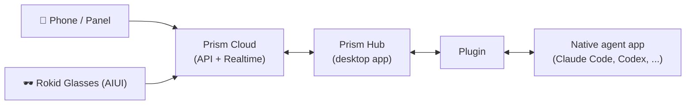

# Rokid Prism


**English** / [中文](#中文)


## What is Prism?

Prism lets you run AI coding agents where they work best — on your desktop — and stay in control from anywhere. Keep Claude Code, Codex, Hermes, or OpenClaw running on your Mac or PC, then pick up your phone or put on your Rokid glasses to check progress, continue the conversation, answer approval requests, or start new tasks.

The Rokid-Prism organization hosts the open-source part of that ecosystem: the **PluginBridge SDK** (this repository) and the **official agent plugins** that connect Prism to local agents.

## Features

- **Full visibility** — an Agent → project → thread tree with online / working status, plus usage stats such as token spend, remaining quota, and day streaks
- **Continue conversations remotely** — send messages and attachments, and follow the full conversation stream rendered with Markdown, tool calls, and step-by-step progress
- **Stay in control** — switch models, reasoning effort, and permission modes; interrupt a running task at any time
- **Approvals & planning** — resolve permission requests, manage queued messages, run agents in plan mode, and set or pause goals
- **Timely notifications** — Web Push alerts for approval requests and task completion
- **Multilingual** — English, 简体中文, 日本語

## Two ways to use Prism

- **Prism Panel (PWA)** — open <https://prism-panel.rokid.com> in a mobile or desktop browser and add it to your home screen. Install once, manage remote tasks from anywhere.
- **Rokid Glasses AIUI** — the recommended companion for Rokid glasses. Collaborate on remote tasks hands-free, any time and anywhere, right from your glasses.

## How it works



Your devices talk to the Prism cloud, the cloud talks to the Prism Hub running on your desktop, and the Hub drives each agent through a plugin. The cloud and desktop layers ship as part of the Prism product — **this organization open-sources and maintains the plugin layer**.

## The Rokid-Prism organization

| Repository | What it does |
| --- | --- |
| **prism-plugin-sdk** (this repository) | The PluginBridge SDK for building plugins — published as a Go module (`github.com/Rokid-Prism/prism-plugin-sdk`), an npm package (`@rokid-prism/pluginbridge-plugin-sdk`), and a PyPI package (`rokid-pluginbridge-plugin-sdk`). Also defines the plugin manifest schema and conformance suite. |
| [prism-plugin-claude-code](https://github.com/Rokid-Prism/prism-plugin-claude-code) | Official Claude Code plugin — protocol-native, speaking ACP to a local `claude` runtime |
| [prism-plugin-codex](https://github.com/Rokid-Prism/prism-plugin-codex) | Official Codex plugin — automates Codex Desktop to browse sessions, read history, and continue threads |
| [prism-plugin-hermes](https://github.com/Rokid-Prism/prism-plugin-hermes) | Official Hermes plugin — remote sessions via the Hermes gateway |
| [prism-plugin-openclaw](https://github.com/Rokid-Prism/prism-plugin-openclaw) | Official OpenClaw plugin — protocol-native against the OpenClaw gateway |

Plugins connect in one of two ways: **protocol-native** plugins talk to the agent through its own protocol (an API, RPC, or CLI), while **desktop-automation** plugins drive the agent's desktop app when no protocol is available. Plugins are distributed as GitHub Releases; the Hub discovers, installs, and updates them automatically.

## About this SDK

The PluginBridge SDK is everything you need to build a Prism plugin in Go, TypeScript/Node.js, or Python. A plugin is a small program described by a `pluginbridge-plugin.yaml` manifest; the Prism Hub launches it and speaks the PluginBridge v4 protocol to it over JSON-lines stdio. All three SDKs expose the same `serve` entry point — you implement handlers with idiomatic language-native types, and the SDK converts them to the locked snake_case wire protocol.

| Language | Distribution | Install |
| --- | --- | --- |
| Go | `github.com/Rokid-Prism/prism-plugin-sdk` | `go get github.com/Rokid-Prism/prism-plugin-sdk@v0.1.1` |
| Node.js | `@rokid-prism/pluginbridge-plugin-sdk` | `npm install @rokid-prism/pluginbridge-plugin-sdk@0.1.1` |
| Python | `rokid-pluginbridge-plugin-sdk` | `pip install rokid-pluginbridge-plugin-sdk==0.1.1` |

```go
import pluginbridge "github.com/Rokid-Prism/prism-plugin-sdk"
```

```ts
import { serve } from "@rokid-prism/pluginbridge-plugin-sdk";
// CommonJS: const { serve } = require("@rokid-prism/pluginbridge-plugin-sdk");
```

```python
from pluginbridge import serve
```

### Repository layout

- `example/` — a minimal working Go plugin (`main.go` + manifest)
- `node/` — the TypeScript/Node.js SDK, with its own [README](node/README.md) and `node/example/`
- `python/` — the Python SDK, with its own [README](python/README.md), tests, and `python/example/`
- `conformance/` — the strict JSON Schemas for plugin manifests and release metadata, plus validation fixtures
- `actions/validate-official-manifest` — a reusable GitHub Action that enforces the official manifest rules in plugin release workflows

### Node module formats

`@rokid-prism/pluginbridge-plugin-sdk` exports both ESM and CommonJS entry points.
Use `import` from ESM or `require` from CommonJS; TypeScript declarations are
shared. The `/desktop-automation-runtime` and `/cdp-runtime` subpaths remain
CommonJS for existing Codex and Hermes adapters.

### Manifest contract

[`conformance/manifest.schema.json`](conformance/manifest.schema.json) is the
strict JSON Schema for a PluginBridge v4 manifest. It permits legacy plugins
to omit icons, but official plugin release CI must require both `icon_url` and
`icon_svg_url`. The same official release check requires `schema_version: 1`
and `plugin_protocol_version: "4"`; the base schema leaves them optional only
for legacy and third-party compatibility.

- `icon_url`: optional absolute HTTPS bitmap URL (max 1024 characters).
- `icon_svg_url`: optional absolute HTTPS SVG URL (max 1024 characters).
- `runtime_dependencies.node`: optional semver range such as
  `>=22.0.0 <23.0.0`.
- `command`: can reference the Hub-managed Node binary only as
  `${runtime.node}`; it is never expanded by the SDK.

The SDK deliberately does not fetch, inline, inspect, or execute SVG files.

[`conformance/plugin-release.schema.json`](conformance/plugin-release.schema.json) defines the signed/checked release
metadata consumed by the Hub registry.

### Release

Tags of the form `v*` validate all three SDKs, build Go and Node artifacts,
and publish npm and PyPI through OIDC trusted publishing. Configure npm trusted
publisher and PyPI trusted publisher for this repository before tagging.

This repository's npm configuration defaults to the npmmirror registry for
dependency installation. The release workflow explicitly switches publishing
to the official npm registry, as required by npm Trusted Publishing.

## Contributing

There are two great ways to help Prism support more agents, better:

### 1. Adapt a plugin when an agent updates

Agents move fast — a new release can change menus, UI, or behavior. If an agent you use has updated and its Prism plugin no longer keeps up, that's a perfect contribution: open an issue on the plugin's repository describing what changed, or submit a pull request adapting the plugin yourself.

### 2. Create a plugin for a new agent

Want Prism to support an agent that isn't covered yet? Create a new repository, build a plugin with this SDK, publish a release, and submit it to the Hub's plugin registry. Once registered, every Prism user can discover and install your plugin. The [manifest contract](#manifest-contract) above and the examples in `example/`, `node/example/`, and `python/example/` are the place to start.

Improvements to the SDK itself — new helpers, docs, bug fixes — are welcome here too: fork → branch → pull request.

**Pull requests**: please follow [Conventional Commits](https://www.conventionalcommits.org) (`feat:`, `fix:`, `chore:`) as the existing history does. All public repositories in the organization are MIT licensed, and contributions are accepted under the same license.

## License

[MIT](./LICENSE)

---

# 中文

**[English](#what-is-prism)** / **中文**


## Prism 是什么？

Prism 让你能从手机等移动设备连接桌面端Agent。让 Codex、Hermes 或 OpenClaw 在你的 Mac 或 PC 上持续工作，然后拿起手机、或戴上 Rokid 眼镜，随时随地查看进度、继续对话、处理审批，或发起新任务。

Rokid-Prism 组织托管这个生态的开源部分：**PluginBridge SDK**（本仓库）与连接 Prism 和本地智能体的**官方插件**。

## 产品功能

- **全局可见** — Agent → 项目 → 线程三层视图，在线 / 工作中状态一目了然，还有 token 用量、剩余额度、连续使用天数等用量统计
- **远程继续对话** — 发送消息与附件，完整对话流实时渲染，支持 Markdown、工具调用与逐步执行进度
- **掌控全局** — 切换模型、推理强度与权限模式，随时中断正在运行的任务
- **审批与规划** — 处理权限审批、管理排队消息、以计划模式运行智能体、设置或暂停目标
- **及时通知** — 审批请求与任务完成的 Web Push 提醒
- **多语言** — English、简体中文、日本語

## 两种使用方式

- **Prism Panel（PWA）** — 在手机或桌面浏览器打开 <https://prism-panel.rokid.com>，即可添加到主屏幕。一次安装，随处管理远程任务。
- **Rokid Glasses AIUI** — 推荐搭配 Rokid 眼镜使用。通过眼镜随时随地进行远程任务协作，解放双手。

## 工作原理


你的设备与 Prism 云端通信，云端与运行在桌面上的 Prism Hub 通信，Hub 再通过插件驱动各个智能体。云端与桌面端随 Prism 产品发布——**本组织开源并维护的是插件层**。

## Rokid-Prism 组织

| 仓库 | 作用 |
| --- | --- |
| **prism-plugin-sdk**（本仓库） | 构建插件的 PluginBridge SDK，以三种语言发布：Go module（`github.com/Rokid-Prism/prism-plugin-sdk`）、npm 包（`@rokid-prism/pluginbridge-plugin-sdk`）、PyPI 包（`rokid-pluginbridge-plugin-sdk`）。同时定义插件 manifest 规范与一致性测试套件。 |
| [prism-plugin-claude-code](https://github.com/Rokid-Prism/prism-plugin-claude-code) | Claude Code 官方插件 — 协议原生，通过 ACP 对接本地 `claude` 运行时 |
| [prism-plugin-codex](https://github.com/Rokid-Prism/prism-plugin-codex) | Codex 官方插件 — 通过桌面自动化操作 Codex Desktop，浏览会话、读取历史、继续线程 |
| [prism-plugin-hermes](https://github.com/Rokid-Prism/prism-plugin-hermes) | Hermes 官方插件 — 通过 Hermes 网关实现远程会话 |
| [prism-plugin-openclaw](https://github.com/Rokid-Prism/prism-plugin-openclaw) | OpenClaw 官方插件 — 协议原生，对接 OpenClaw 网关 |

插件以两种方式之一接入智能体：**协议原生**通过智能体自身的协议（API、RPC 或 CLI）通信；**桌面自动化**在没有开放协议时操作智能体的桌面应用。插件以 GitHub Releases 分发，Hub 会自动发现、安装并更新它们。

## SDK 简介

PluginBridge SDK 提供 Go、TypeScript/Node.js、Python 三种语言开发 Prism 插件所需的一切。一个插件是由 `pluginbridge-plugin.yaml` manifest 描述的小程序：Prism Hub 启动它，并通过 JSON-lines stdio 以 PluginBridge v4 协议通信。三种语言的 SDK 都提供相同的 `serve` 入口——你用各语言的原生类型实现处理函数，SDK 负责转换为锁定的 snake_case 线协议。

| 语言 | 包 | 安装 |
| --- | --- | --- |
| Go | `github.com/Rokid-Prism/prism-plugin-sdk` | `go get github.com/Rokid-Prism/prism-plugin-sdk@v0.1.1` |
| Node.js | `@rokid-prism/pluginbridge-plugin-sdk` | `npm install @rokid-prism/pluginbridge-plugin-sdk@0.1.1` |
| Python | `rokid-pluginbridge-plugin-sdk` | `pip install rokid-pluginbridge-plugin-sdk==0.1.1` |

仓库结构：`example/` 是最小可运行的 Go 插件；`node/`、`python/` 分别是各自语言的 SDK（含独立 README 与示例）；`conformance/` 是 manifest 与 release 元数据的严格 JSON Schema 及校验夹具；`actions/validate-official-manifest` 是供插件发布流程复用的官方 manifest 校验 Action。

manifest 契约、Node 模块格式、发布流程（OIDC trusted publishing）等技术细节见上方英文部分的 [About this SDK](#about-this-sdk)。

## 如何贡献

想让 Prism 支持更多、更好的智能体？有两种绝佳的参与方式：

### 1. 智能体更新时，为插件贡献适配

智能体迭代很快——一次版本更新就可能改变菜单、界面或行为。如果你在用的智能体更新了，而对应的 Prism 插件还没跟上，这就是一个完美的贡献机会：在插件仓库提一个 Issue 说明变化，或者直接提交 Pull Request 完成适配。

### 2. 为新智能体创建插件

希望 Prism 支持尚未覆盖的智能体？创建一个新仓库，用本 SDK 开发插件，发布 Release 并提交注册到 Hub 的插件目录。注册完成后，所有 Prism 用户都能发现并安装你的插件。上手请看 [About this SDK](#about-this-sdk) 与 `example/`、`node/example/`、`python/example/` 中的示例。

SDK 本身的改进——新的辅助函数、文档、缺陷修复——同样欢迎：fork → 分支 → Pull Request。

**Pull Request**：提交信息请遵循 [Conventional Commits](https://www.conventionalcommits.org)（`feat:`、`fix:`、`chore:`），与现有提交历史保持一致。本组织所有公开仓库均采用 MIT 协议，贡献同样按 MIT 授权。

## 协议

[MIT](./LICENSE)
